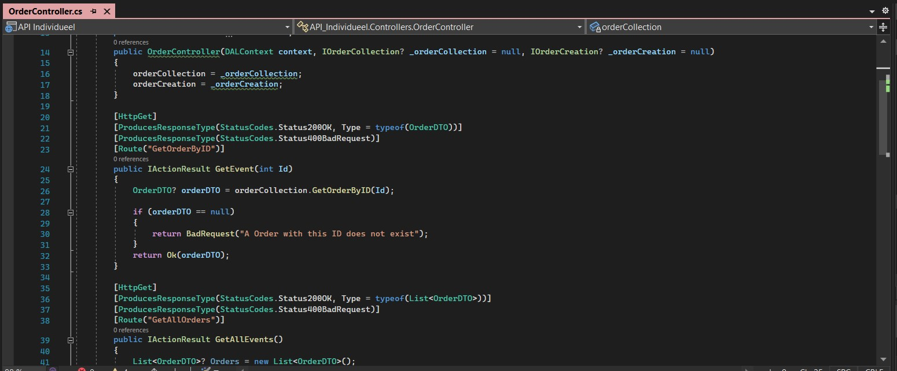

__My Learning Outcomes__

__Table of Contents__

1. Web Application
2. Software Quality
3. CI/CD
4. Professional
   
__Web Application__

Summary of project.

1. __Front-end__

    Respository: [Individuele Project](https://github.com/timojw/Individuele-Project)


2. __Back-end__

    Respository: [Individuele Project](https://github.com/timojw/Individuele-Project)

    

    As seen above I have used multiple layers to structure my API. In the Image below you can see how which layer is dependent on which.

    

    

    Above you can see how my controller is structured. It also has custom return messages. I have decided to build my back-end using the c# language because I had previous experience making an API in c# in the GroupProject.

    

    In the picture above you can see that i have used Swagger UI for the documentation of my API. Because it saves me a lot of time for API documentation. And is comprehensible for developers and non-developers.

__Software Quality__

    For this learning outcome I made automated tests for my API. I also used the automatically generated SQL Database which is stored locally as my test database to test Integration and Unit tests.

    1. Unit Testing

    2. Integration Testing
    3. Automated Testing
    4. Merge Checks / SonarCloud

__CI/CD__

1. Docker

    In simple terms, Docker is a software platform that simplifies the process of building, running, managing and distributing applications. It does this by virtualizing the operating system of the computer on which it is installed and running. It allows us to use containers of the application that can run everywhere. I use docker because I want to automatically build and deploy my application once I push to the main branch on github.

    Below you can see the containers I'm using. There is one for the API, Database and Front-End. They all run on the same docker. I also added a container for watchtower, which will check for updates every 10 minutes and restart the docker containers when changes are found.

    

    To automatically deploy I use a Github workflow which contains some tests as well. In the picture below you can see how the steps for the Build part of the workflow are structured. Both the Front-End and API automatically deploy.

    

   The file seen below basically tells github how to build and deploy the application.

    ```
    name: Main

    on:
    push:
        branches: [ main ]
    pull_request:
        branches: [ main ]

    jobs:
    build:
        runs-on: ubuntu-latest
        steps:
        - uses: actions/checkout@v3
        - name: Setup .NET
        uses: actions/setup-dotnet@v2
        with:
            dotnet-version: 6.0.x
        - name: Restore dependencies
        run: dotnet restore "./API Individueel//" 
        - name: Build
        run: dotnet build --no-restore "./API Individueel//"
        - name: Test
        run: dotnet test --no-build --verbosity normal "./API Individueel//"


    deployment:
        name: deployment
        runs-on: ubuntu-latest
        needs: build
        steps:
        - name: Checkout repository
        uses: actions/checkout@v2
        - name: Set up Docker Buildx
        uses: docker/setup-buildx-action@v1
        - name: Login to DockerHub
        uses: docker/login-action@v1
        with:
            username: ${{ secrets.DOCKER_HUB_USERNAME }}
            password: ${{ secrets.DOCKER_HUB_TOKEN }}
        - name: Build and push
        uses: docker/build-push-action@v2
        with:
            context: ./
            file: ./API Individueel/Dockerfile
            push: ${{ github.event_name != 'pull_request' }}
            tags: ${{ secrets.DOCKER_HUB_USERNAME }}/
            individueel:latest
    ```

    Sources:

    [Docker Simplified: A Hands-On Guide for Beginners](https://medium.com/free-code-camp/docker-simplified-96639a35ff36#06d9)

    [What is Docker and why is it so darn popular?](https://www.zdnet.com/article/what-is-docker-and-why-is-it-so-darn-popular/)


__Professional__