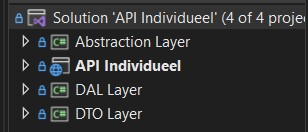
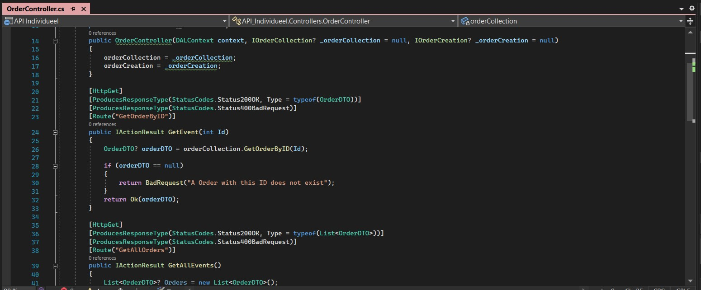
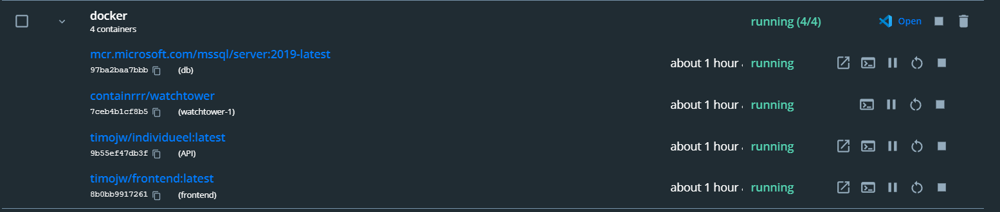
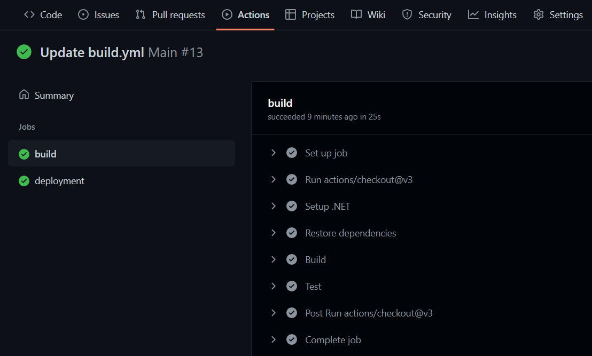
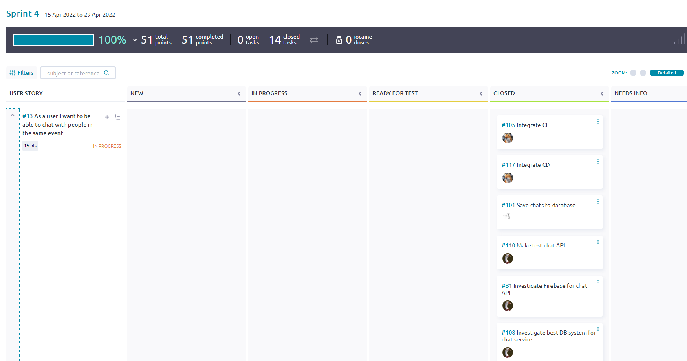
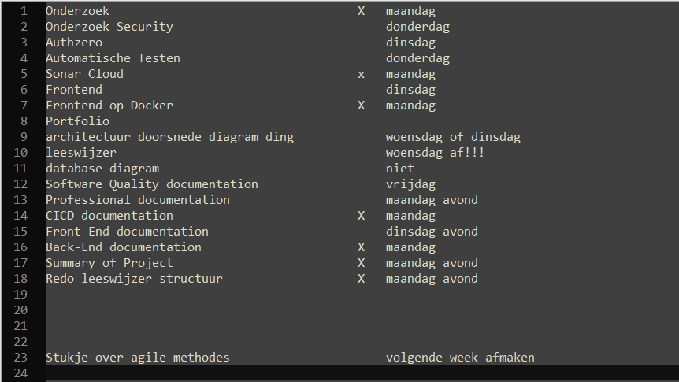

# My Learning Outcomes

## Table of Contents
   - [Project description](#Project-description)
   - [Class Diagram](#class-diagram)
   - [C4 Models](#C4-Models)
     - [C2 Container Diagram](#C2-Container-Diagram)
     - [C3 Component Model](#C3-Component-Model)
   - [Outcome 1: You design and build user friendly full stack web applications](#Outcome-1-You-design-and-build-user-friendly-full-stack-web-applications)
     - [Front-End](#front-end)
     - [Back-End](#back-end)
   - [Outcome 2: Tooling and methodology](#Outcome-2-Tooling-and-methodology)
   - [Outcome 3: Design and implement (release process)](#Outcome-3-Design-and-implement-release-process)
     - [Docker](#docker)
     - [GitHub Workflows](#github-workflows)
   - [Outcome 4: Professional manner](#Outcome-4-Professional-manner)

## Project description
The goal of this project was to create an application for food deliverers, to make them more efficient, easy to use and eventually to make sure the food gets delivered faster. I chose this project due to the fact that I work at a restaurant that also does food delivery. We use an existing app for that, although it is lacking some features and definately could use an upgrade.

## Class Diagram
Class diagrams are the blueprints of your system or subsystem. You can use class diagrams to model the objects that make up the system, to display the relationships between the objects, and to describe what those objects do and the services that they provide.

I have decided to make a Class Diagram because working with the class diagram was great for me in past semesters. It also really sped up the development further on. By making it I also finaly decided on what the structure of the project would be for the time being.

#### Sources:
- [Class Diagrams](https://www.ibm.com/docs/en/rsm/7.5.0?topic=structure-class-diagrams)

## C4 Models 
### C2 Container Diagram
In this diagram you can see that the homeowner has access to the HAP-dashboard. The homeowner has the possibility to Browse all IOT measurements from the browser when authorized by the login provider Auth0.

### C3 Component Model
In this model you can see which services the client uses, if a user makes a request, it goes through the controller that allows the user to use the sensor data, the data access component will provide the functionality related to signing in and sensor data storage.

## Outcome 1: You design and build user friendly full stack web applications
You design and build user friendly full stack web applications

### Front-end
Repository: [Front-End Individueel](https://github.com/timojw/frontend-Individueel2)

### Back-end
Repository: [Individuele Project](https://github.com/timojw/Individuele-Project)

As seen above I have used multiple layers to structure my API. To keep the dependencies right I used dependency inversion using an dependency injection container located in the program.cs

Above you can see how my controller is structured. It also has custom return messages. I have decided to build my back-end using the c# language because I had previous experience making an API in c# in the GroupProject.

In the picture above you can see that i have used Swagger UI for the documentation of my API. Because it saves me a lot of time for API documentation. And is comprehensible for developers and non-developers.

## Outcome 2: Tooling and methodology
You use software tooling and methodology that continuously monitors and improve the software quality during software development

For this learning outcome I made automated tests for my API. I also used the automatically generated SQL Database which is stored locally as my test database to test Integration and Unit tests.

1. Unit Testing
2. Integration Testing
3. Automated Testing
4. Merge Checks / SonarCloud

## Outcome 3: Design and implement release process
You design and implement a semi automated software release process that matches the needs of the project context

### Docker

In simple terms, Docker is a software platform that simplifies the process of building, running, managing and distributing applications. It does this by virtualizing the operating system of the computer on which it is installed and running. It allows us to use containers of the application that can run everywhere. I use docker because I want to automatically build and deploy my application once I push to the main branch on github.

Below you can see the containers I'm using. There is one for the API, Database and Front-End. They all run on the same docker. I also added a container for watchtower, which will check for updates every 10 minutes and restart the docker containers when changes are found.

### GitHub Workflows

To automatically deploy I use a Github workflow which contains some tests as well. In the picture below you can see how the steps for the Build part of the workflow are structured. Both the Front-End and API automatically deploy.

Below you can see part of the file that basically tells github how to build and deploy the application. You can only see the build part.

    build:
        runs-on: ubuntu-latest
        steps:
        - uses: actions/checkout@v3
        - name: Setup .NET
        uses: actions/setup-dotnet@v2
        with:
            dotnet-version: 6.0.x
        - name: Restore dependencies
        run: dotnet restore "./API Individueel//" 
        - name: Build
        run: dotnet build --no-restore "./API Individueel//"
        - name: Test
        run: dotnet test --no-build --verbosity normal "./API Individueel//"
Full file:
[Github Workflow File](https://github.com/timojw/Individuele-Project/blob/main/.github/workflows/main.yml)

#### Sources:
- [Docker Simplified: A Hands-On Guide for Beginners](https://medium.com/free-code-camp/docker-simplified-96639a35ff36#06d9)

- [What is Docker and why is it so darn popular?](https://www.zdnet.com/article/what-is-docker-and-why-is-it-so-darn-popular/)

## Outcome 4: Professional manner

You act in a professional manner during software development and learning
### Project Board
For the group project I extensively used Taiga as a way to keep track of our features and the progress we were making. All the tasks were linked to a requirement that we put up before the project started. Once a sprint was over we devided a few of the remaining learning outcomes into tasks and divided them over our group.

Taiga is definately a website that I would recommend for this. It seems more professional than trello which I used before. Although it did also have some disadvantages like the fact that you can only assign one person to a task.

I chose not to make a project board for my own individual project due to the fact that it takes lots of time to properly maintain, which was time I could spend elsewhere. Also the benefits of using such a project board in group projects are way bigger due to the fact that other people are also able to see your progress that way.
### ToDo List
For the last couple of weeks I decided to make a ToDo list for myself after a feedback talk with one of my teachers who recommended me this. I know this is kinda a primitive technique but it worked wonders for me. During these weeks I made the most progress, which was partly caused by the list.

