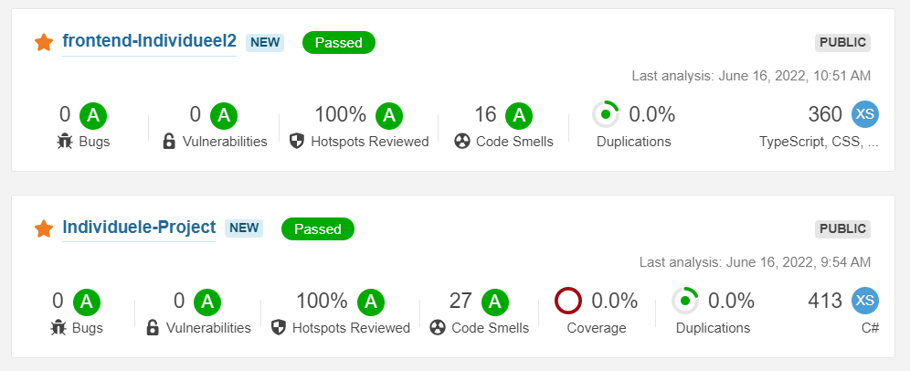

# My Learning Outcomes

## Table of Contents
   - [Outcome 1: You design and build user friendly full stack web applications](#Outcome-1-You-design-and-build-user-friendly-full-stack-web-applications)
     - [Design](#design)
     - [Front-End](#front-end)
     - [Back-End](#back-end)
   - [Outcome 2: Tooling and methodology](#Outcome-2-Tooling-and-methodology)
   - [Outcome 3: Agile Methods](#outcome-3-agile-methods)
   - [Outcome 4: Design and implement (release process)](#outcome-4-design-and-implement-release-process)
     - [Docker](#docker)
     - [GitHub Workflows](#github-workflows)
   - [Outcome 5: Cultural Differences](#outcome-5-you-recognize-and-take-into-account-cultural-differences)
   - [Outcome 6: ](#outcome-6-you-translate-requirements-to-extend-existing-designs)
   - [Outcome 7: Business Processes](#outcome-7-you-analyze-and-describe-simple-business-processes)
   - [Outcome 8: Proffesional Manner](#outcome-8-you-act-in-a-professional-manner)
     - [Project Board](#project-board)
     - [Reflection](#reflection)
     - [To-Do List](#todo-list)

## Outcome 1: You design and build user friendly full stack web applications
You design and build user friendly full stack web applications

### Design
#### Project description
The goal of this project was to create an application for food deliverers, to make them more efficient, easy to use and eventually to make sure the food gets delivered faster. I chose this project due to the fact that I work at a restaurant that also does food delivery. We use an existing app for that, although it is lacking some features and definately could use an upgrade.

#### Class Diagram
Class diagrams are the blueprints of your system or subsystem. You can use class diagrams to model the objects that make up the system, to display the relationships between the objects, and to describe what those objects do and the services that they provide.

I have decided to make a Class Diagram because working with the class diagram was great for me in past semesters. It also really sped up the development further on. By making it I also finally decided on what the structure of the project would be for the time being.

#### Sources:
- [Class Diagrams](https://www.ibm.com/docs/en/rsm/7.5.0?topic=structure-class-diagrams)

#### C4 Models 
##### C2 Container Diagram
A Container diagram zooms into the software system in scope, showing the high-level technical building blocks.

##### C3 Component Model
A Component diagram zooms into an individual container, showing the components inside it.

- [C4 Source](https://c4model.com/)

### Front-end
Repository: [Front-End Individueel](https://github.com/timojw/frontend-Individueel2)

Due me not having a lot of time I decided to not focus much effort on the front end. I chose this because I dislike front end development and had heard that a minimal front-end would be sufficient for me. The front end was made in Typescript React. This was the first time I used this framework which is why I needed some time to get used to it. Overall I would say that the framework worked for me although the documentation on Typescript was sometimes not as good as the documentation on JavaScript. 

I have the Front end communicating with my API as you can see below. I can either request data from the database or add to it. Although the current possibilities are quite limited, it does show that I am capable of making the communication happen. If I had had more time I would have definitely liked to add more functionality.

Below is the code for the creation of the HTTP request to the API. The information is being send in the body and is a JSON format.

    export const CreateOrder = async (Latitude:number | undefined, Longitude:number | undefined, RestaurantID:number | undefined) => {
      const data = await 
          fetch (
              'http://localhost:80/Order/CreateOrder',{
                  method:"POST",
                  headers: {
                      "Content-Type":"application/json"
                  },
                  body:JSON.stringify({
                  "Latitude":Latitude,
                  "Longitude":Longitude,
                  "Status":0,
                  "RestaurantID": RestaurantID
                  })
                }
              )
      return data.status;

### Back-end
Repository: [Back-End Individueel](https://github.com/timojw/Individuele-Project)

As seen below I have decided to use a layer structure in my API. To keep the dependencies between the layers right I used a dependency injection container located in the program.cs

Below you can see how my controller is structured. It has custom return messages. I have decided to build my back-end using the c# language because I had previous experience making an API in c# in the GroupProject.

In the picture below you can see that i have used Swagger UI for the documentation of my API. Because it saves me a lot of time for API documentation. And is comprehensible for developers and non-developers. 

### Auth0

For the Authentication I used an external service called Auth0. Using a pre-made authentication service saves me a lot of time. It also is a safe way to do this.

## Outcome 2: Tooling and methodology
You use software tooling and methodology that continuously monitors and improve the software quality during software development

For this learning outcome I made automated tests for my API. I also used the automatically generated SQL Database which is stored locally as my test database to test Integration and Unit tests.

### Postman
To test my back end I have used postman to setup some requests which a monitor will test every 2 hours. The results will get mailed to me when they are not working.

Due to me not having a lot of logic, I can't really make good unit tests. Although I did have plans to add more logic if I had had the time to do so. This is why I decided against making Unit tests.

### SonarCloud
Using a [github workflow](https://github.com/timojw/Individuele-Project/blob/main/.github/workflows/build.yml) sonarcloud scannes the code of both my front-end and back-end projects. 

As you can see below it they both passed with good scores. But there are some code smells, I use sonarcloud to look up and fix these smells, vunerabilities and bugs.

## Outcome 3: Agile Methods

## Outcome 4: Design and implement release process

You design and implement a semi automated software release process that matches the needs of the project context

### Docker

In simple terms, Docker is a software platform that simplifies the process of building, running, managing and distributing applications. It does this by visualizing the operating system of the computer on which it is installed and running. It allows us to use containers of the application that can run everywhere. I use docker because I want to automatically build and deploy my application once I push to the main branch on GitHub.

Below you can see the containers I'm using. There is one for the API, Database and Front-End. They all run on the same docker. I also added a container for watchtower, which will check for updates every 10 minutes and restart the docker containers when changes are found.

### GitHub Workflows

To automatically deploy I use a GitHub workflow which contains some tests as well. In the picture below you can see how the steps for the Build part of the workflow are structured. Both the Front-End and API automatically deploy.

Below you can see part of the file that basically tells GitHub how to build and deploy the application. You can only see the build part.

    build:
        runs-on: ubuntu-latest
        steps:
        - uses: actions/checkout@v3
        - name: Setup .NET
        uses: actions/setup-dotnet@v2
        with:
            dotnet-version: 6.0.x
        - name: Restore dependencies
        run: dotnet restore "./API Individueel//" 
        - name: Build
        run: dotnet build --no-restore "./API Individueel//"
        - name: Test
        run: dotnet test --no-build --verbosity normal "./API Individueel//"
Full file:
[Github Workflow File](https://github.com/timojw/Individuele-Project/blob/main/.github/workflows/main.yml)

#### Sources:
- [Docker Simplified: A Hands-On Guide for Beginners](https://medium.com/free-code-camp/docker-simplified-96639a35ff36#06d9)

- [What is Docker and why is it so darn popular?](https://www.zdnet.com/article/what-is-docker-and-why-is-it-so-darn-popular/)

## Outcome 5: You recognize and take into account cultural differences
To prove that I can recognize and take into account cultural differences I have written a research paper on Culteral Differences. Trying to use a dot framework.

Check out my paper [here](../Research/Cultural%20Differences.md)!

I have also written a document about ethics. In this document I answer questions like, What are ethics and what they have to do with software development. Later I also talk about what a software engineer can do to adress ethical subjects and what ethical problems in my project I encountered.

Check out my ethics document [here](../Research/Ethics.md)

## Outcome 6: You translate requirements to extend existing designs

## Outcome 7: You analyze and describe simple business processes
For this learning outcome I have written a document on business processes. In this document I write down what business processes are, how they relate to software development and, most importantly, how I used business processes in my project. I have also visualized a business process from my IP and described all the steps.

Check out my business process document [here](../Research/Business%20Processes.md)!

## Outcome 8: You act in a professional manner
You act in a professional manner during software development and learning
### Project Board
For the group project I extensively used Taiga as a way to keep track of our features and the progress we were making. All the tasks were linked to a requirement that we put up before the project started. Once a sprint was over we devided a few of the remaining learning outcomes into tasks and divided them over our group.

Taiga is definately a website that I would recommend for this. It seems more professional than trello which I used before. Although it did also have some disadvantages like the fact that you can only assign one person to a task.

I chose not to make a project board for my own individual project due to the fact that it takes lots of time to properly maintain, which was time I could spend elsewhere. Also the benefits of using such a project board in group projects are way bigger due to the fact that other people are also able to see your progress that way.

### Reflection
The way that I planned this semester was poor. Doing all of the work in the last weeks is not a good way to do this. I could have been spared a lot of stress and sleepless nights if I had just started earlier. Although this is easier said than done appereantly. In the beginning of this year I had sirieus motivation issues, which is the main reason why I couldn't bring myself to work alot on school.

This experience will definately be something that I'm going to take with me to next Semester. Next time I'm going to start earlier, I would also like to have more one on one talks with my teacher next semester.

Although the start could have been better, my final couple of weeks were super productive this was partly attributed to my to-do list which I will talk about in more detail below.

### ToDo List
For the last couple of weeks I decided to make a ToDo list for myself after a feedback talk with one of my teachers who recommended me this. I know this is kinda a primitive technique but it worked wonders for me. During these weeks I made the most progress, which was partly caused by the list.

