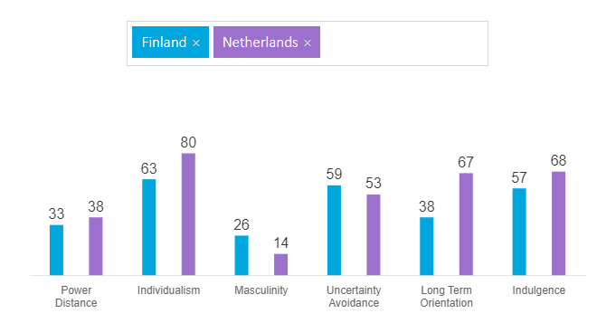

# Onderzoek naar culturele verschillen
__What?__
In dit onderzoek wil ik erachter komen wat cultuur is, wat het te maken heeft met software development en hoe ik om kan gaan met mensen uit een andere cultuur.

__Why?__
Dit wil ik weten omdat ik in de toekomst waarschijnlijk met mensen uit een andere cultuur moet werken, en dat heb ik zelfs al mogen doen dit semester. 

__How?__
Ik wil dit onderzoeken door eerst te kijken wat cultuur eigenlijk betekend (library research), daarna ga ik kijken naar welke dimensies er zijn van culturele verschillen (library research). Daarna ga ik ook mijn eigen ervaringen van dit semester in gedachte nemen.

## Wat is cultuur?

In brede zin duidt cultuur op hetgeen een samenleving voortbrengt en van generatie op generatie overdraagt, zowel materieel als immaterieel. 
In materiële zin gaat het om gebruikte methoden in de landbouw of agricultuur, tuinbouw of horticultuur, bosbouw of silvicultuur en wijnbouw of viticultuur.

Bij uitbreiding verwijst cultuur naar menselijke activiteiten als religie, wetenschap, tradities, gewoonten, levensstijl, normen en waarden, en daarnaast ook de formelere inrichting van een samenleving, bijvoorbeeld het gehanteerde rechtsstelsel en het gebruikte kiessysteem. 
Deze betekenis is in het Nederlands de huidige, belangrijkste denotatie van de term cultuur.
De cultuurgeschiedenis beschrijft de culturele geschiedenis van een samenleving.

## Waarom is het belangrijk om cultuur in gedachte te houden voor software ontwikkelaars

Tegenwoordig zijn software engineers veel incontact met mensen uit andere culturen. Zo kunnen je client of je mede software engineer mensen zijn met andere culturen. De kans dat je met die andere mensen te maken gaat krijgen is erg groot. Daarom is het belangrijk bewust te worden van de andere culturen en hoe je daarmee om moet gaan.

## Wat zijn bekende dimensies van culturele verschillen?
### De Hofstede Theorie
Het Hofstede-model split de nationale cultuur in dimensies. Die dimensies zijn verschillende schalen waarop elke cultuur net iets anders scoort. Volgens de Hofstede theorie zijn er 6 culturele dimensies. Die dimensies zijn:

- __Individualism - Collectivism__
Individualisme kan worden gedefinieerd als een voorkeur voor een samenleving waarbij de meeste mensen alleen voor zichzelf en hun dichte familie zorgen. Terwijl Collectivisme juist het tegenovergestelde vertegenwoordigd. Namelijk een voorkeur voor een samenleving waarin mensen voor elkaar zorgen.

- __Uncertainty avoidance__
Deze dimensie laat zien hoe ongemakkelijk mensen uit een samenleving worden wanneer er onzekerheid ontstaat. Hoe gaat een samenleving om met het feit dat de toekomst nooit getekend kan worden?

- __Power distance__
Deze dimensie drukt de mate uit waarin de minder machtige leden in de samenleving accepteren dat de macht oneerlijk verdeeld is. De onderliggende vraag is hoe een bepaalde samenleving omgaat met ongelijkheid.

- __Masculinity - Feminimity__
De mannelijkheidskant van deze dimensie vertegenwoordigd de voorkeur voor prestatie, heldhaftigheid en materiele beloningen. De vrowelijkheidskan vertegenwoordigd juist de voorkeur voor bescheidenheid, zorg en kwaliteit van het leven. Ookwel stoere vs tedere culturen.

- __Long vs Short term orientation__
Samenlevingen die laag scoren op deze dimensie houden liever vast aan oude tradieties en normen, en bekijken verandering met argwaan. Terwijl samenlevingen die hoog scoren vaak verder in de toekomst denken en verandering aanmoedigen.

- __Indulgence vs Restraint__
Indulgence staat voor een samenleving met met relatief vrije bevrediging mogelijk maakt. Een samenleving waarbij het voor mensen vooral gaat om genieten van het leven en plezier maken. Restraint staat voor precies een samenleving waarbij de behoeftebevrediging word onderdrukt en gereguleert word.

Via [deze](https://www.hofstede-insights.com/country-comparison/finland,the-netherlands/) website kun je verschillende culturen met elkaar vergelijken op de dimensies van het Hofstede model. Hieronder zie je bijvoorbeeld dat de Finse en Nederlandse cultuur geen extreme verschillen hebben. Op sommige dimensies zijn Nederland en Finland bijna gelijk maar op andere zoals Long-Term-Orientation verschelen ze veel.

## Wat is mijn cultuur?
Ik kom uit nederland en mijn cultuur is dus nederlands. 
Een paar aspecten van de nederlandse cultuur zijn bijvoorbeeld bepaalde tradities en feestdagen. 
Enkele typish nederlandse feestdagen en tradities zijn Sinterklaas, Bevrijdingsdag en Koningsdag. 
Er staan ook een aantal christelijke feestdagen op de feestdagenkalender. Nederland heeft ook een aantal nationale symbolen, zoals de vlag van nederland met het oranje lintje, maar ook het wilhelmus, het nederlandse volkslied.
Eten en drinken hoort ook bij cultuur. Traditionele Nederlandse gerechten zijn bijvoorbeeld stamppot met rookworst, hagelslag en Nederlandse kaas.

## Met welke andere cultuur ben ik mee in contact geweest, en wat waren de verschillen met mijn cultuur?

Samen met mijn proftaak-groepje heb ik een project gemaakt met studenten uit Oulu, een stad in Finland.
Voordat we begonnen waren met het project zijn ik, Rens en Tjerk naar Oulu geweest om het project te plannen en afspraken te maken. 
Daar hebben we eerst een leuke vakantie gehad en daarna productief gewerkt met de studenten. 

Finnen zijn in het algemeen rustige en gesloten mensen, maar als je eenmaal contact hebt zijn ze erg warm en vriendelijk. 
Ongeveer 80% van de Finse bevolking leeft in een stad. 
Ondanks dat is Finland is erg dunbevolkt, er wonen 17 mensen per vierkante kilometer. 
Ter vergelijking: in Nederland zijn dit er 418.

Deze vriendelijkheid hebben wij snel gemerkt bij de Finse studenten die wij hebben leren kennen. 
Zij nodigde ons al snel uit om bij 1 van die studenten thuis met zn allen wat te gaan drinken en eten. 
Ook zijn we daar in de sauna geweest, sauna's zijn typish Fins. 
Er is geen ander land in de wereld met meer sauna's dan Finland. 
Bijna iedereen heeft er wel een in zijn/haar huis.

## Hoe ging de communicatie met de personen uit de andere cultuur en wat doe ik volgende keer beter?

Over het algemeen ging het communiceren goed. 
Het helpt dat we allemaal goed engels spreken en elkaar dus makkelijk kunnen begrijpen. 
Wel ga ik volgende keer langzaam meer en meer te weten komen over hun achtergrond en is het verstandig om geinteresseerd te zijn maar niet al te overdreven. 
Tijdens mijn interactie met de Finse mensen ben ik er op die manier achter gekomen dat de Finse mensen erg trots zijn op hun land en een beetje militaristisch op sommige gebieden dat komt vooral door hun geschiedenis.

Ik heb veel geleerd van het samenwerken met de Finse studenten. 
Voordat ik naar Finland was gegaan heb ik redelijk veel gereisd maar meestal bleef ik dan in mijn eigen bubbel en had ik weinig contact met mensen uit de regio. 
Dat was helemaal anders tijdens mijn tijd in Finland. 
Gelukkig waren de Finse studenten erg aardig en ze vertelde veel over Finland en de cultuur daar.

## Sources

- [Cultuur](https://nl.wikipedia.org/wiki/Cultuur)
- [The 6 dimensions of national culture](https://www.hofstede-insights.com/models/national-culture/)
- [De cultuur van Nederland](https://nl.wikipedia.org/wiki/Cultuur_van_Nederland)
- [De cultuur in Finland](https://mokkitravel.nl/alles-over-lapland/cultuur-finland/#:~:text=Finnen%20zijn%20in%20het%20algemeen)